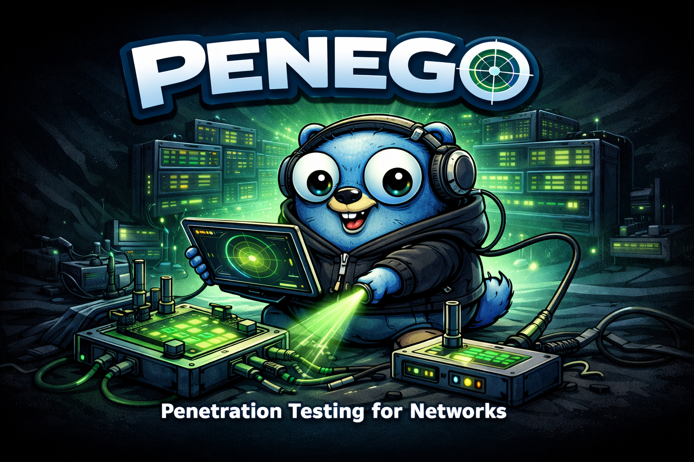

# Penego - Network Penetration Testing Toolkit



## 🔍 Overview
Penego is a comprehensive network penetration testing framework designed for security professionals...

## ✨ Features
- Network reconnaissance and scanning
- Vulnerability assessment
- Exploitation modules
- Reporting tools

## 📸 Demonstration

## 🚀 Quick Start
```bash
git clone https://github.com/yourusername/penego.git
cd penego
python3 penego.py --help