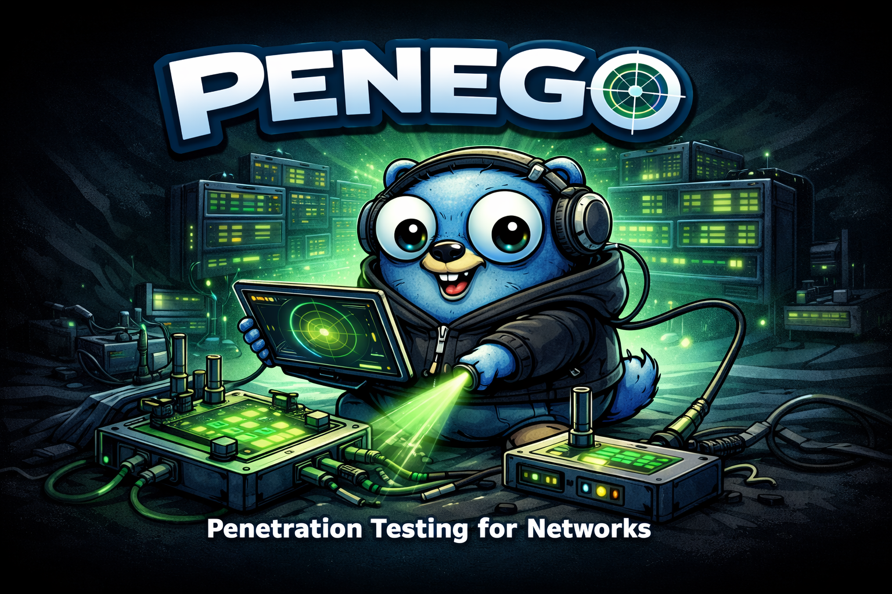

# Penego

**Penego** is a local **assessment-focused network penetration testing toolkit**. Organize work into **engagements**, run discovery/port/enum/vuln/auth-check jobs, track assets and findings, and export professional HTML reports. It does **not** include exploit payloads or RCE modules.



> **Legal notice:** Only assess networks you are authorized to test.

---

## Capabilities

| Area | Features |
|------|----------|
| **Engagements** | Named assessments with scope CIDRs, assets, findings, scan timeline |
| **Recon** | Host discovery, TCP/UDP ports, OS fingerprint (`nmap`), traceroute |
| **Enumeration** | HTTP title/Server, TLS cert CN/SANs/expiry, reverse DNS, SMB peek |
| **Vulns** | Embedded banner/version rule pack → structured findings + remediation |
| **Auth testing** | Single credential verify (SSH / FTP / HTTP Basic) — no mass spray |
| **Pipeline** | One-click: discovery → ports → enum → vuln → asset upsert |
| **Reporting** | Per-scan JSON/HTML + engagement rollup HTML (print to PDF) |
| **Hardening** | Login users/roles, scope enforcement, rate limits, audit log, purge |

---

## Quick start

```bash
cp .env.example .env
# set DATABASE_DSN, ADMIN_PASSWORD, SESSION_SECRET
go run .
```

Open http://127.0.0.1:8585 — default user `admin` / `ADMIN_PASSWORD`.

**Suggested flow:** create an **Engagement** → open it → **Run pipeline** (or individual modules with the engagement ID) → review **Findings** → **Export Report**.

Docker: `docker compose up --build`

Full docs: [docs/README.md](docs/README.md) · Operator guide: [docs/10-user-guide.md](docs/10-user-guide.md)
