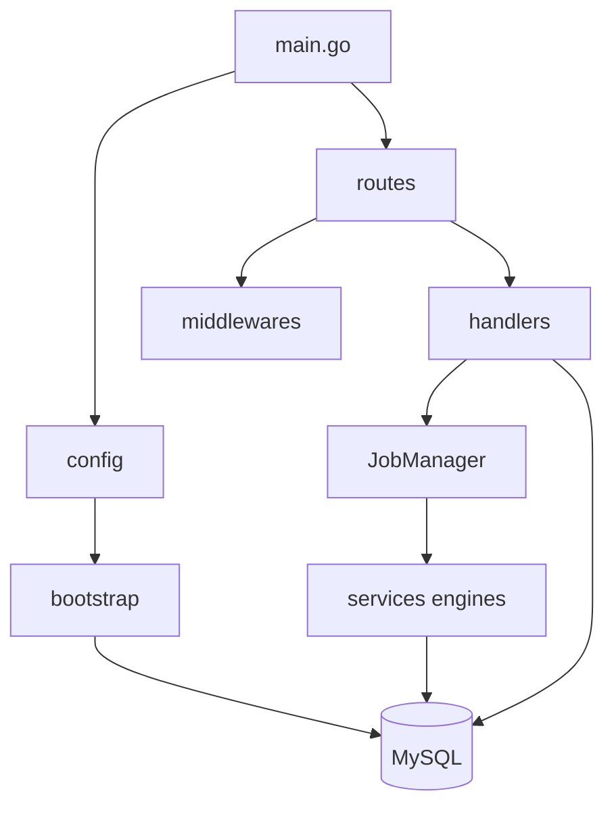
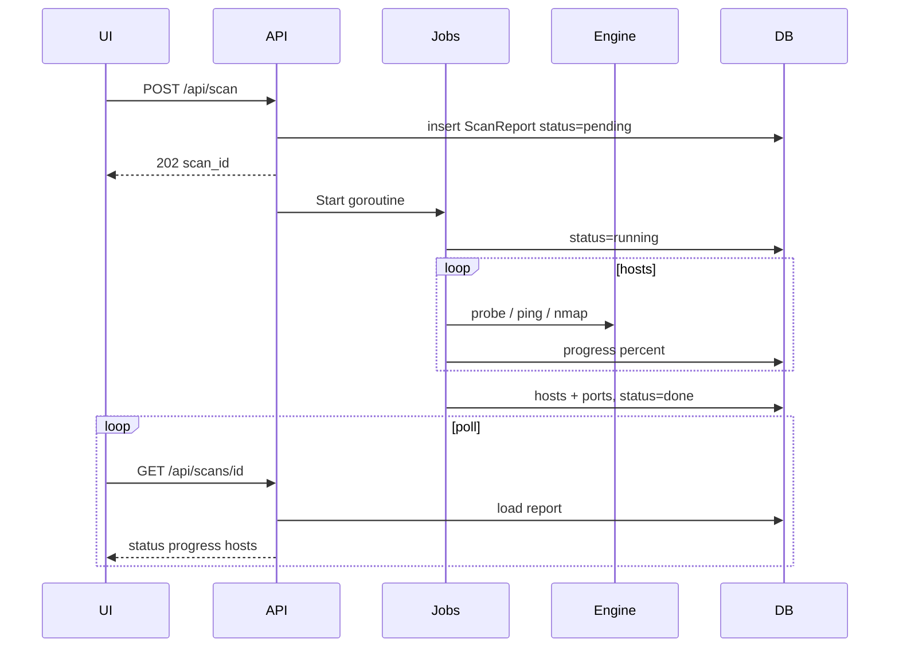

# 02 — Architecture

## Startup sequence

1. **`config.Load()`** — optional `.env` file, then process environment. `DATABASE_DSN` is required.
2. **`bootstrap.CheckDependencies()`** — logs whether `ping` / `nmap` are usable.
3. **`bootstrap.ConnectDB` + `AutoMigrate`** — MySQL schema for reports, hosts, ports, findings, audit logs.
4. **`services.NewJobManager`** — background scan runner with cancel map.
5. **Gin** — parse embedded templates, mount `/assets`.
6. **`routes.Register`** — session middleware, rate limit, public login, auth-gated pages/API.
7. **`LISTEN_ADDR`** — default `127.0.0.1:8585`.

## Package roles

| Package | Responsibility |
|---------|----------------|
| `config` | Env parsing, defaults, limits |
| `bootstrap` | DB + migrate + CLI dependency warnings |
| `routes` | Wire URLs to handlers |
| `middlewares` | Session cookie auth, per-IP rate limit |
| `handlers` | Bind JSON/forms, audit, HTTP status codes |
| `services` | Pure-ish scan logic, jobs, reports, mapping |
| `models` | Persistence + `ToScanReportJSON` API shape |

## Async job lifecycle

## Auth and limits

- Session HMAC cookie (`penego_session`) after successful `/login`.
- `RequireAuth` redirects HTML to `/login` or returns `401` for `/api/*`.
- `AUTH_DISABLED=true` sets user to `anonymous` (lab convenience only).
- `RateLimit` is an in-memory fixed window per client IP.
- Scan caps: `MAX_HOSTS`, `MAX_PORTS`, separate host/port concurrency.

## Embedding

Templates and assets are compiled into the binary (`//go:embed`). Changing HTML/CSS/JS requires a rebuild (or temporary disk-based loading for rapid UI iteration).
