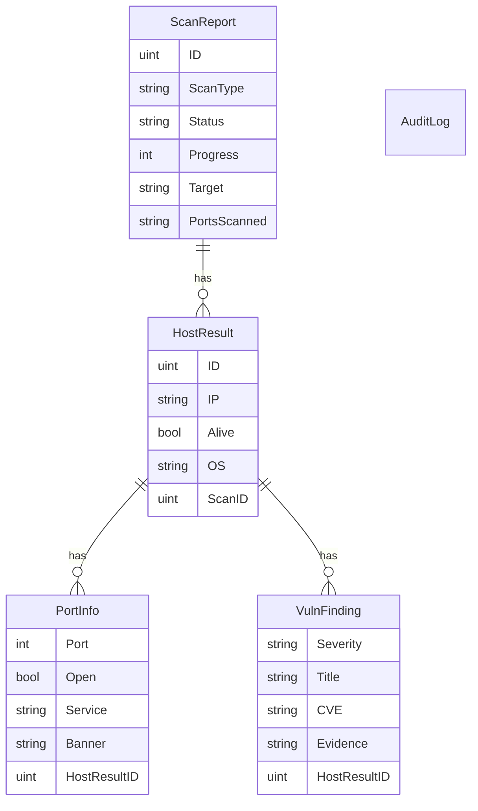

# 03 — Data Models

All entities use GORM’s embedded `gorm.Model` (`ID`, timestamps, soft delete).

## Entity relationship

## ScanReport

| Field | Meaning |
|-------|---------|
| `ScanType` | `port_scan`, `host_discovery`, `os_fingerprint`, `vuln_scan` |
| `Status` | `pending` → `running` → `done` \| `failed` \| `cancelled` |
| `Progress` | 0–100 while running |
| `Target` | Original IP or CIDR string |
| `PortsScanned` | Port list or mode label |
| `Hosts` | All hosts for the scan |

API responses still expose **`true_targets`** / **`false_targets`** (alive vs not) via `models.ToScanReportJSON`, derived from `Hosts[].Alive`.

## HostResult / PortInfo / VulnFinding

- `HostResult.ScanID` → parent report
- `PortInfo.HostResultID` → parent host (not the report)
- `VulnFinding` stores severity, title, optional CVE, and banner evidence

## AuditLog

Records `who`, `action` (`start_scan`, `delete_scan`, `cancel_scan`, …), `target`, `detail`, and client `IP`.

## Migration notes

`AutoMigrate` adds new columns/tables. Databases created with the **pre-rewrite** schema (e.g. `PortInfo.scan_id` naming) should be recreated for a clean install. Soft-deleted rows remain until purged.
